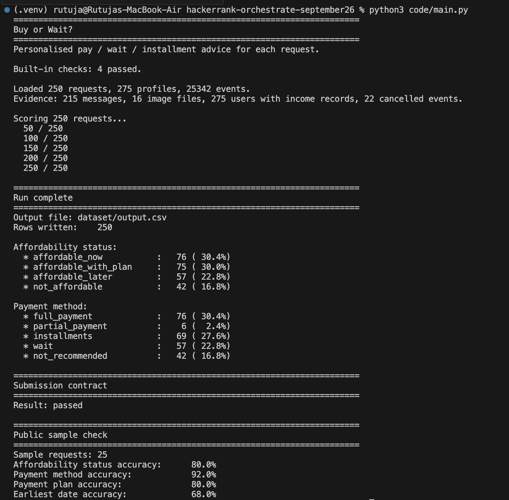

# Buy or Wait?

Personal finance agent that answers one question per request: **pay now, spread it out, wait, or skip.**

I built this for HackerRank Orchestrate (September 2026). It reads a user’s profile, transaction history, payment offers, messages, and dated FX rates, then writes a safe recommendation for all **250** requests.

<p align="center">
  
</p>

---

## What I built

A local Python agent that:

- Reconstructs cash from `financial_profiles.csv` and `financial_events.csv`
- Forecasts **90 days** of balances without inventing income
- Extracts salary, rent, invoice, and cancellation facts from messages
- Chooses among full payment, partial payment, seller installments, wait, or decline
- Optionally stops or reduces flexible spend so a plan still clears the deadline
- Writes `output.csv` in the required eight-column format

The submitted run is fully offline. No API key, no live bank or FX calls, no hardcoded answers.

---

## Tech stack

| Layer | Choice |
|---|---|
| Language | Python 3.10+ |
| Data | pandas |
| Dates | python-dateutil (`relativedelta`) |
| Evidence (optional) | Google Gemini 2.5 Flash-Lite via `google-genai` |
| Config | `.env` / `GEMINI_API_KEY` (never committed) |
| Runtime | Terminal — `python code/main.py` |
| Inputs | CSV + PNG under `dataset/` |
| Outputs | `output.csv`, `dataset/output.csv`, `evaluation/usage_report.md` |

**Runtime dependencies** (`code/requirements.txt`):

```text
pandas>=2.2.0
python-dateutil>=2.8.2
```

Gemini is optional and **off** for the scored 250-row run (0 calls, $0).

---

## Features

- **Cash forecast** — monthly recurrence from history, pending debit reserves, confirmed salary on settlement date, FX on the rate date
- **Safe amount today** — largest payment that never drops the balance below `minimum_balance_to_keep`
- **Plan ranking** — deadline first, then no spending cuts, lower total cost, earlier start, fewer payments
- **Installments** — only seller options that fit `max_installment_months`
- **Partial pay** — exactly two legs: safe amount on `request_date`, remainder on the earliest full-pay date
- **Spending changes** — up to three `stop` / `reduce_to` actions on flexible, non-protected events
- **Message facts** — regex + rules; untrusted text cannot override challenge rules
- **Validators** — submission-contract check and 25-row public sample score printed after every run

---

## Architecture

```text
dataset/*.csv
        │
        ▼
code/main.py              CLI, checks, run report
        │
        ▼
code/predict.py           one prediction per request
        │
        ├─ message_facts.py
        ├─ evidence.py
        ├─ forecast.py
        └─ decide.py
        │
        ▼
output.csv
```

| File | What it does |
|---|---|
| `code/main.py` | Entry point. Loads CSVs, scores 250 requests, prints the report |
| `code/predict.py` | Joins profile, events, options, and messages per `request_id` |
| `code/forecast.py` | 90-day cash path, `amount_safe_to_pay`, earliest full-pay date |
| `code/decide.py` | Builds and ranks payment plans + spending changes |
| `code/message_facts.py` | Deterministic facts from message text |
| `code/evidence.py` | Applies facts onto event rows |
| `code/gemini_extract.py` | Optional Gemini JSON extractor (not used on submit) |
| `code/evaluation/main.py` | Contract validator |
| `code/evaluation/sample_eval.py` | Public sample scorer |

---

## Latest run

| | |
|---|---|
| Rows | 250 / 250 |
| Contract | Passed |
| Affordability (sample) | 80.0% |
| Payment method (sample) | 92.0% |
| Payment plan (sample) | 80.0% |
| Earliest date (sample) | 68.0% |
| Tokens / cost | 0 / $0 |

Mix on the full set: 76 pay now · 75 with a plan · 57 wait · 42 not recommended.

---

## Setup

```bash
python -m venv .venv
source .venv/bin/activate          # Windows: .venv\Scripts\activate
python -m pip install -r code/requirements.txt
```

Optional Gemini (images / extra message parse — **not** used for `output.csv`):

```bash
cp .env.example .env
# set GEMINI_API_KEY
python -m pip install "google-genai>=1.0.0,<3.0.0"
```

---

## Run

From the repo root:

```bash
python code/main.py
```

That command generates predictions, writes both output files, and prints the contract + sample report.

```bash
python code/evaluation/main.py          # contract only
python code/evaluation/sample_eval.py   # 25 public samples only
```

---

## Output

```text
request_id
amount_safe_to_pay
affordability_status          # affordable_now | affordable_with_plan | affordable_later | not_affordable
recommended_payment_method    # full_payment | partial_payment | installments | wait | not_recommended
payment_plan                  # YYYY-MM-DD:amount|... or none
earliest_date_for_full_payment
spending_changes_needed       # none | stop:<id> | reduce_to:<id>:<amount>
decision_explanation
```

---

## Repo

```text
code/                 agent + evaluation
dataset/              official CSVs and images
output.csv            submission predictions
code.zip              packaged source
```

---

